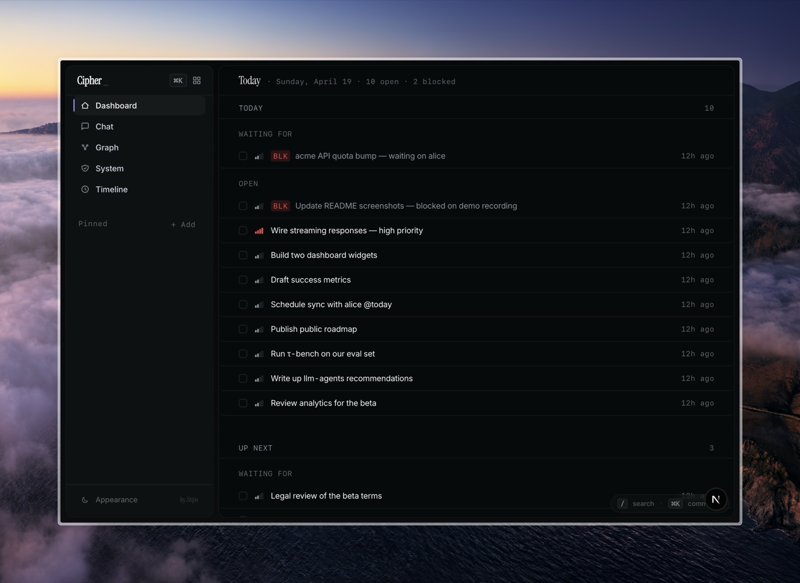
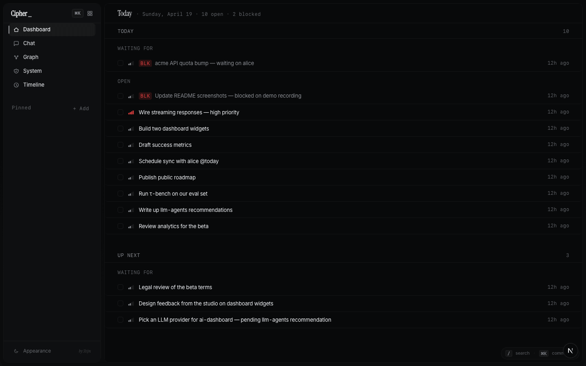
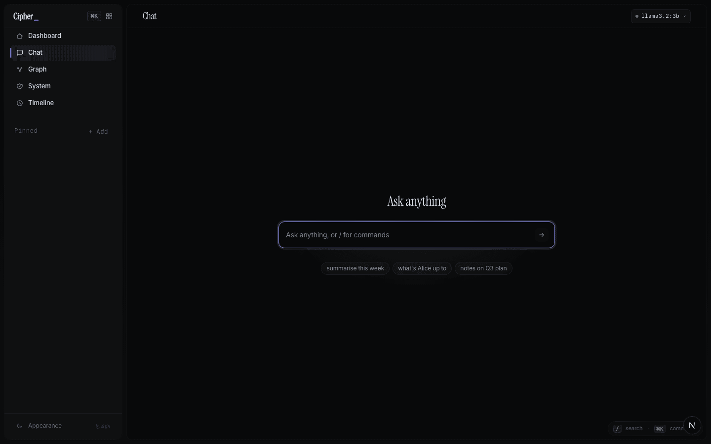
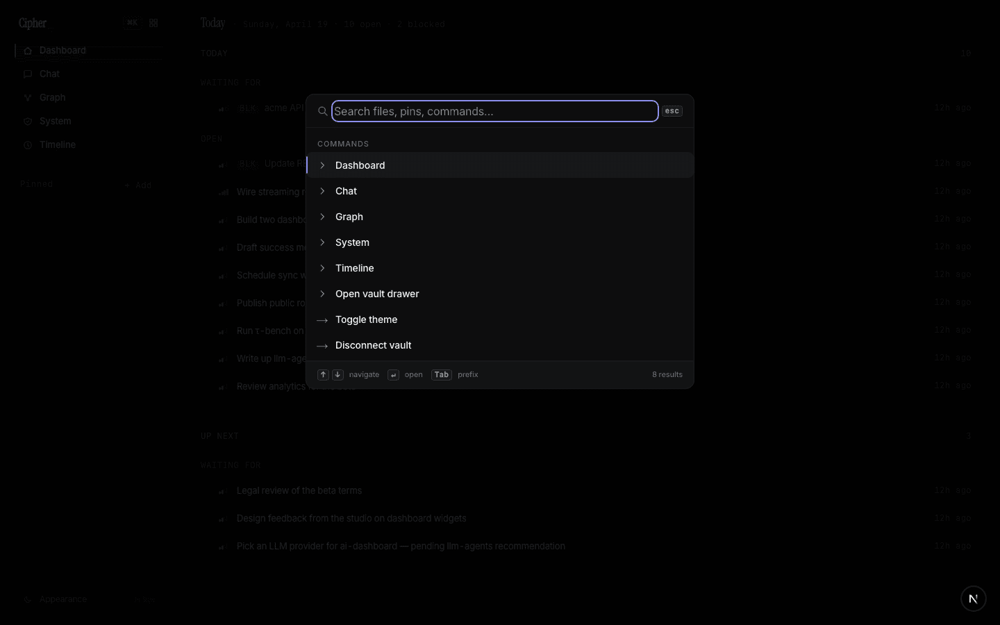
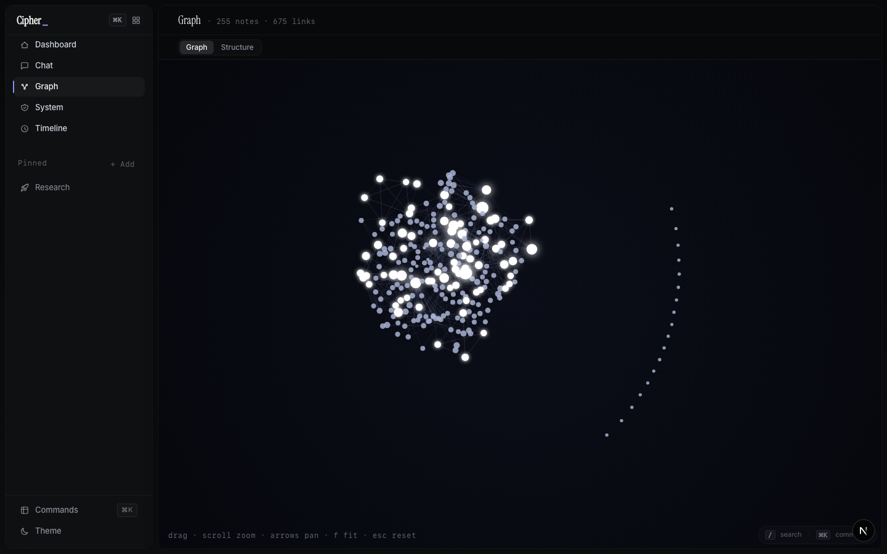
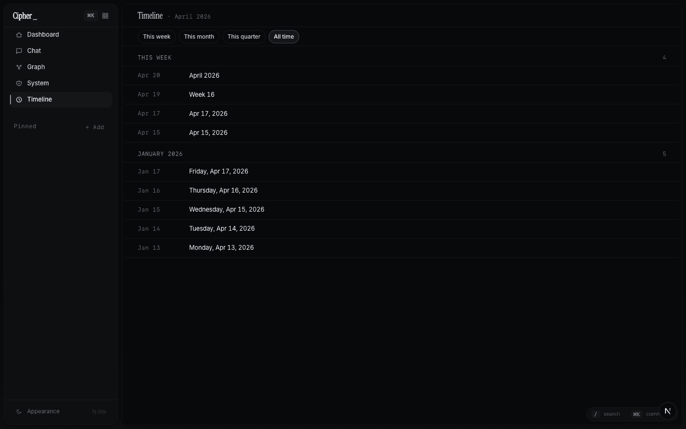
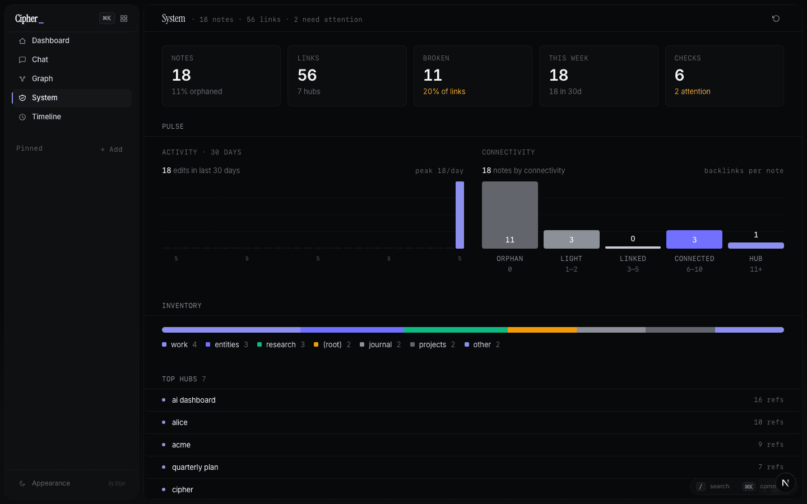
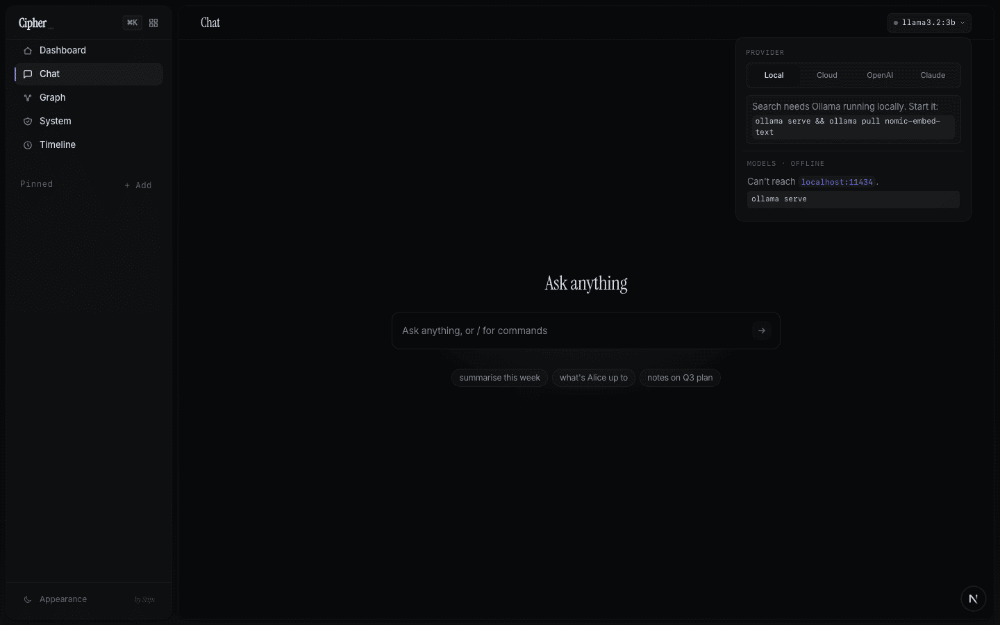

<p align="center">
  
</p>

<h1 align="center">cipher</h1>

<p align="center">
  <b>Obsidian for readers, not writers.</b><br/>
  A local AI frontend for your Markdown vault — chat, graph, structure, ⌘K.
</p>

<p align="center">
  <a href="#quickstart"><b>Quickstart</b></a> ·
  <a href="#whats-in-it"><b>What's in it</b></a> ·
  <a href="#llm-setup"><b>LLM setup</b></a> ·
  <a href="#status"><b>Status</b></a>
</p>

---

## Cipher is for you if

- ✅ You keep a folder of Markdown notes and love how local-first that feels.
- ✅ You want to *ask* your vault questions, not just search it.
- ✅ You want a graph view that's actually useful, not just pretty.
- ✅ You'd rather keep your notes + keys on your own machine than trust a cloud.
- ✅ You're comfortable running a Next.js app from source.
- ✅ You want something you can fork and make yours, not a SaaS.

## Cipher is *not*

- ❌ A second Obsidian. If you want the editor, stick with Obsidian.
- ❌ A note-taking app. Cipher reads your vault; it doesn't try to own your writing.
- ❌ A CMS or publishing tool. Nothing is hosted for you.
- ❌ A chatbot product. The chat is grounded in your notes, not general-purpose.
- ❌ A multi-user anything. One person, one machine, one vault.

Cipher is a Next.js app I built for my own vault. Everything stays on your machine unless you opt into a cloud model. No plugins, no sync service, no account.

---

## Quickstart

```bash
npx github:stijnhanegraaf/Cipher my-vault
```

Clones the repo, installs dependencies, asks for your `VAULT_PATH`, writes `.env.local`. Then `cd my-vault && npm run dev`.

Prefer the manual path?

```bash
git clone https://github.com/stijnhanegraaf/Cipher
cd Cipher && npm install
echo "VAULT_PATH=/path/to/your/vault" > .env.local
npm run dev
```

Open http://localhost:3000. If you don't set `VAULT_PATH`, cipher probes a few common spots (`~/Obsidian`, `~/Documents/Obsidian`, `~/Projects/Obsidian`, a sibling `../Obsidian`). No vault handy? The repo ships a 15-file sample vault you can point at with `VAULT_PATH=$(pwd)/public/sample-vault npm run dev`.

For chat, you'll also want [Ollama](https://ollama.com) running locally — see [LLM setup](#llm-setup) below.

---

## What's in it

### Dashboard

<p align="center">
  
</p>

Your open tasks, waiting-fors, and blocked items pulled from the journal and work areas of the vault. Quiet when there's nothing to do. Click any row to open the source note and strike it through from here.

### Chat

<p align="center">
  
</p>

Ask a question, get a streamed answer with citations back to the notes it pulled from. A handful of common intents (`/today`, `/system`, `/graph`, timeline, entity / topic lookups) get rendered as structured view cards instead of prose, because a list of open tasks reads better as a list than as a paragraph. Everything else falls through to the LLM with hybrid retrieval over your vault.

The question you asked renders in Instrument Serif, the answer in Inter, sources as pills that stagger in when the stream completes. Hover any assistant message for copy / regenerate.

### Command palette (⌘K)

<p align="center">
  
</p>

One key, one panel. Opens with your recent files + pins + commands already listed — no typing required for the common case. Type to get a merged ranked list across every file in the vault, entities, projects, and commands. Prefix scopes: `>` for commands, `@` for entities and projects, `#` for headings inside whichever file you have open in the sheet. Enter routes by result type: files open the detail sheet, pins open the scoped drawer, commands run, headings deep-link.

This is the fastest way to get anywhere in cipher. I almost never click the sidebar.

### Map — Graph + Structure

<p align="center">
  
</p>

`/browse/graph` has a `Graph | Structure` toggle.

**Graph** is a force-directed map of your vault with hub-weighted physics, an orphan ring for disconnected notes, and a **focus mode** that isolates a node's 1-hop subgraph with a camera glide and a HUD card listing backlinks + outlinks.

**Structure** is the other side of the toggle — Miller columns, horizontally-scrolling folders with a 360px file-preview panel on the right. For when you want to drill down rather than zoom out.

### Timeline

<p align="center">
  
</p>

A monthly synthesis of journal entries grouped by theme.

### System

<p align="center">
  
</p>

Vault-health: broken links, stale notes, orphaned files, the entities that show up most often.

### Detail sheet

Click any file anywhere — sidebar, palette result, graph node, citation pill — and it slides in from the right as a sheet. Wiki-link previews, backlinks, frontmatter, the whole note. The sheet is additive; your previous view stays mounted behind it.

### Vault index

cipher calls `getVaultLayout()` on the folder you pointed it at and figures out what role each top-level folder plays. Journal / entities / projects / research / work / system / hub-file get detected by common names first (`journal`, `daily`, `diary`, `days`…), then by what's inside the folder if the name doesn't match (three or more `YYYY-MM-DD.md` files → journal, `open.md` / `waiting-for.md` → work, and so on). Drop a `<vault>/.cipher/layout.json` to override anything the probe gets wrong. Fields you omit still auto-detect.

No required folder names. No restructuring.

---

## LLM setup

<p align="center">
  
</p>

Default is local Ollama. Install it, `ollama pull llama3.2` (or whatever you want to use), `ollama pull nomic-embed-text` for embeddings, and you're done — cipher talks to `localhost:11434` and nothing leaves your machine.

If you'd rather use a cloud model, the model picker in the top-right has four providers:

- **Local** — Ollama on `localhost:11434`. Free, private, offline-capable.
- **Cloud** — Ollama Cloud. Paste an Ollama API key.
- **OpenAI** — paste an OpenAI key, pick a GPT model.
- **Claude** — paste an Anthropic key, pick a Claude model.

Keys are stored locally in `<vault>/.cipher/llm.json`. Retrieval embeddings always run through local Ollama regardless of which chat provider is active (Anthropic has no embeddings API, and running `nomic-embed-text` locally is the cheap universal option). So even if you're chatting with GPT or Claude, you still want Ollama up.

Health endpoint: `GET /api/chat/health` tells you whether the active provider is reachable and whether Ollama-local is up for embeddings.

---

## Vault layout

cipher probes `getVaultLayout()` on startup and works with a typical Obsidian vault out of the box. Three-tier detection:

1. **By name** — common folder names (`entities` / `people` / `contacts`, `journal` / `daily`, `projects`, `research`, `work`, `system`). Folders under a `wiki/` root work too.
2. **By content** — if a role isn't found by name, cipher scans top-level folders and infers from what's inside.
3. **Explicit override** — drop a `<vault>/.cipher/layout.json` with any fields you want to pin. Omitted fields still auto-detect.

Anything the probe doesn't find is silently ignored; the feature that depends on it just doesn't render.

Pins for the sidebar live in `<vault>/.cipher/sidebar.json` — whatever syncs your vault (Obsidian Sync, iCloud, Dropbox, git) syncs your pins.

---

## Tech

Next.js 16 App Router, React 19, TypeScript strict. Tailwind v4, single-token design system in `src/app/globals.css`. Inter for UI, Instrument Serif for display surfaces (page titles, empty-state headings, asked questions, sheet titles). Vercel AI SDK for streaming, Ollama for embeddings, no database — the vault is the state.

Read-only on your filesystem; no auth, no telemetry, no server-side history.

```bash
npm run dev          # dev server on :3000
npm run build        # production build
npm run start        # serve production build
npx tsc --noEmit     # type check
```

No test framework. Verification is tsc + build + a manual walk.

---

## Status

This is a personal tool. I open-sourced it because it works for me and a few people asked. I'll respond to issues and PRs on a whim, not on a schedule. If you fork it and take it somewhere weirder, I'd love to see it.

Single-user by design — there's no auth layer. If you want to reach it from multiple devices, stick it on a VPS behind [Tailscale](https://tailscale.com/) and call it from `http://<tailnet-name>:3000`. Same convenience as a hosted app, your data never leaves hardware you control.

---

## License

MIT. See `LICENSE`.
