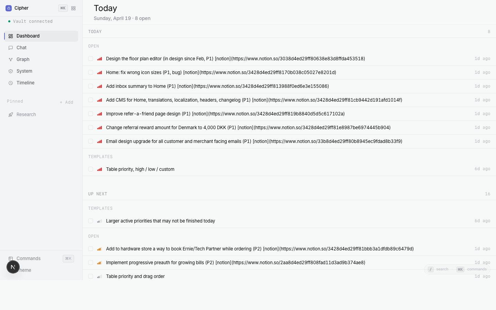

<h1 align="center">Cipher</h1>

<p align="center">
  <strong>An AI-native chat + dashboard frontend for your Obsidian vault.</strong>
</p>

<p align="center">
  Point it at <em>any</em> Obsidian vault — no restructuring, no plugins, no sync setup.<br/>
  Get a Today dashboard, force-directed Graph, Timeline, System health, and AI chat that understands your notes.<br/>
  Everything runs locally. Your data stays on your machine.
</p>

<p align="center">
  <a href="LICENSE"></a>
  
  
  
</p>

<p align="center">
  
</p>

<p align="center">
  
  &nbsp;
  
</p>

---

## What Cipher is

Cipher is a local web app that reads your **Obsidian vault** (or any folder of markdown with wiki-links). Point it at the folder where your `.md` files live, ask questions in chat, and get bespoke pages — Today, System health, Timeline, a force-directed Graph, Entity / Topic detail — instead of wall-of-text answers. Nothing leaves your machine.

### Load your Obsidian vault in 30 seconds

```bash
git clone https://github.com/stijnhanegraaf/brain-frontend
cd brain-frontend
npm install
echo "VAULT_PATH=/path/to/your/Obsidian" > .env.local
npm run dev
# open http://localhost:3000
```

That's it. No plugin to install inside Obsidian, no sync configuration, no vault restructuring. Cipher opens the folder read-only, probes its structure (entities / journal / projects / research / work / system — whatever layout you use), and every page lights up.

> **Works with any Obsidian vault layout.** Cipher auto-detects folder roles by common names (`entities`/`people`/`contacts`, `journal`/`daily`, `projects`, `research`, `work`, `system`, …). Folders under a `wiki/` root work too. No folder renaming required.

## Key features

- **Chat** with slash commands (`/today`, `/system`, `/graph`, …) and hover-action Copy / Regenerate
- **Today dashboard** with optimistic task check-off + undo
- **System health** — 30-day activity sparkline, 5-bucket connectivity chart, broken-link detection, stale-note detection, top hubs
- **Graph** — force-directed vault map with hub-weighted physics, orphan ring, bloom halos
- **Bespoke pages** for System, Timeline, Search, Entity, Topic — not chat chrome, real pages with breadcrumbs + deep links
- **Custom pinned sidebar** — pin any folder with a label + icon; config lives in your vault so it syncs with it
- **Linear-grade design system** — 4px grid, single token source in `globals.css`, dark + light, keyboard-first
- **Local-only** — no auth, no remote server, no telemetry

## Auto-detection + sample vault

If you don't set `VAULT_PATH`, Cipher probes common locations on startup — `~/Obsidian`, `~/Documents/Obsidian`, `~/Projects/Obsidian`, sibling `../Obsidian`. First one it finds wins.

### Don't have a vault yet?

The repo ships with a tiny sample vault (~15 markdown files covering every folder role) so you can run Cipher with zero setup:

```bash
VAULT_PATH=$(pwd)/public/sample-vault npm run dev
```

Every page will light up — Today shows tasks, System has checks + broken links, Timeline has activity, Graph renders a small cluster, Entity/Topic pages resolve.

## Point it at your vault

Cipher auto-detects folder roles by name. This table shows what it looks for:

| Role in Cipher | Your folder can be named… |
|---|---|
| Entities (people, companies, systems) | `entities`, `people`, `contacts`, or `knowledge/entities` |
| Journal (per-day notes) | `journal`, `daily`, `daily-notes` |
| Projects | `projects` or `knowledge/projects` |
| Research | `research` or `knowledge/research` |
| Work (open, waiting-for, logs, weeks) | `work` or `tasks` |
| System (status, health, open-loops) | `system` |
| Hub file | `dashboard.md`, `index.md`, `home.md`, or `README.md` at the vault root |

Folders under a `wiki/` root are auto-detected too. Anything the probe doesn't find is simply ignored — the feature that depends on it just doesn't render a section.

## Customising the sidebar

Two ways to pin a folder:

- **`+ Add` in the Pinned group** — type or pick a path, choose a label + icon, save.
- **Hover-pin in the vault drawer** — hover any folder row and click the pin icon. Defaults to the folder name; edit later via double-click.

Your pins are saved to `<vault>/.cipher/sidebar.json`. Whatever syncs your vault (Obsidian Sync, iCloud, Dropbox) syncs your pins.

<p align="center">
  
</p>

## Project layout

```
src/
  app/                 Next.js 16 App Router routes + API endpoints
    api/               /api/query, /api/today, /api/settings/sidebar, /api/vault/*
    browse/            /browse, /browse/system, /browse/timeline, /browse/graph, …
    chat/              /chat surface
    file/[...path]/    direct file view
  components/          React components
    browse/            TodayPage, SystemPage, TimelinePage, GraphPage, …
    sidebar/           Sidebar extras (PinDialog)
    ui/                Reusable primitives (PinIcon, StatusDot, Badge, HoverCard, …)
    views/             Chat-summary renderers (ViewRenderer + per-view modes)
  lib/
    vault-reader.ts    Vault layout probe + schema-aware readers + search
    vault-health.ts    Activity / broken-links / stale-notes / hubs scanner
    vault-graph.ts     Nodes + edges builder (cached per vault)
    view-builder.ts    Intent -> typed view model
    intent-detector.ts NL -> intent classifier
    settings.ts        <vault>/.cipher/sidebar.json read/write
    today-builder.ts   Today page data aggregation
```

## Development

```bash
npm run dev          # dev server on :3000
npm run build        # production build
npm run start        # serve production build
npx tsc --noEmit     # type check
```

No test framework yet. Verification is manual + `curl` for the API routes + `grep` for token/convention compliance.

## Architecture + concepts

For a deeper tour of how the pieces fit together, read:

- `docs/ARCHITECTURE.md` — request life-cycle, module map, vault-layout probe.
- `docs/CONCEPTS.md` — glossary of recurring terms (intent, view model, hub, orphan, sheet, scoped drawer, …).

## Design language

Every colour, padding, radius, font size, and motion duration in Cipher comes from a CSS custom property defined in `src/app/globals.css`. Components reach for the tokens (`var(--accent-brand)`, `var(--row-h-cozy)`, `var(--motion-hover)`, `.app-row`, `.focus-ring`) instead of inventing their own values. This is what makes the app feel like one thing instead of assembled parts. Contributions that add new UI should stick to the existing tokens — add a new token only when no existing one fits.

## Contributing

PRs welcome. Read `CONTRIBUTING.md` for the code-style rules and PR checklist.

## License

MIT — see `LICENSE`. Your data stays on your machine; the license on your modifications is yours.
